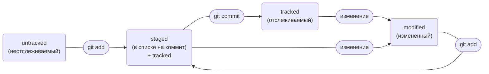

# Создание репозитрия
```
git init # создали репозиторий 
```


# Удаление репозитория («Разгитить» папку)
```
rm -rf .git # удалили подпапку .git 
```


# Текущее состояние репозитория
```
git status # показывает текущее состояние репозитория
```
## Какие состояния показывает команда git status

- staged (Changes to be committed в выводе git status);
- modified (Changes not staged for commit);
- untracked (Untracked files).

---
# Добавление файлов в репозиторий:

## Все файлы
```
git add --all # подготовили к сохранению все файлы в репозитории
```

## Всю текущую папку
```
git add . # добавить всю текущую папку
```

## Отдельный файл
```
git add <file_name>
```


---
# Коммит репозитория
```
git commit -m "<Комментарий>" 
```


---
# Добавление изменений в последний коммит
- добавить изменения к последнему коммиту и оставь сообщение прежним:
```
git commit --amend --no-edit
```
- изменить сообщение к последнему коммиту на <Новое сообщение>:
```
git commit --amend -m "<Новое сообщение>"
```


---
# «Откат» файлов и коммитов
- перевести файл file.txt из состояния staged обратно в untracked или modified
```
git restore --staged file.txt
```
- вернуть файл file.txt к последней версии, которая была сохранена через git commit или git add:
```
git restore file.txt
```
- удалить все незакоммиченные изменения из staging и «рабочей зоны» вплоть до указанного хеш коммита (b576d89):
```
git reset --hard b576d89
```


---
# Просмотр изменений
```
git diff # показать изменения в «рабочей зоне», то есть в modified-файлах
```
```
git diff a9928ab 11bada1 # вывести разницу между двумя хешами коммита (a9928ab 11bada1)
```
```
git diff --staged # показать изменения, которые добавлены в staged-файлах
```


---
# Просмотреть историю коммитов
```
git log # посмотреть все коммиты
```
Вот из каких элементов состоит описание:
1. Строка из цифр и латинских букв после слова commit — это уже знакомый вам хеш коммита.
2. Author — имя автора и его электронная почта.
3. Date — дата и время создания коммита.
4. Сообщение к коммиту.

```
git log --oneline # сокращённый лог
```
При этом в терминале появятся только первые несколько символов хеша каждого коммита и комментарии к ним.

---
# Привязать удалённый репозиторий к локальному
```
git remote add origin git@github.com:%ИМЯ_АККАУНТА%/%НАЗВАНИЕ_ПРОЕКТА%.git
```

* origin (англ. «источник») — стандартный псевдоним, с помощью которого можно обращаться <br>к главному удалённому репозиторию (обычно такой репозиторий один). <br>Это значительно упрощает работу.


# Убедиться, что репозитории связаны
```
git remote -v
```


# Отправить изменения на удалённый репозиторий
- В первый раз эту команду нужно вызвать с флагом -u и параметрами origin (имя удалённого репозитория) и main или master (название текущей ветки):
```
git push -u origin master
```
* Самая первая ветка в репозитории появляется автоматически и называется main (англ. «основная»)<br> или master. Её имя нужно указывать при отправке коммитов на удалённый <br>репозиторий или при получении их из него.

- В последующий раз эту команду выполнять в кратком виде:
```
git push
```


---
# Клонировать репозиторий

```
git clone git@github.com:%ИМЯ_АККАУНТА%/%НАЗВАНИЕ_ПРОЕКТА%.git # укажите адрес репозитория, который нужно склонировать
```
* Команда создаст копию удалённого репозитория на вашем компьютере. В качестве параметра команде нужно передать адрес репозитория, который вы скопировали на GitHub.
* Команда git clone автоматически связывает локальный и удалённый репозитории. То есть если в GitHub-репозитории что-то поменяется (например, добавятся коммиты), вам не <br>нужно будет заново клонировать его. Достаточно будет выполнить команду, которая обновит вашу копию.
- git fetch — загружает информацию о новых коммитах и ветках с сервера, но не изменяет локальные файлы. 
- git pull — выполняет fetch, а затем автоматически сливает полученные изменения с текущей рабочей веткой.

# Fork - Нажмите Create fork в GitHub (англ. «создать копию репозитория»)
* Fork (англ. «развилка», «ответвление»), или «форк», — это GitHub-операция; напрямую с Git она не связана. «Форк» создаёт копию репозитория в аккаунте GitHub. Такая копия <br>будет полностью независима. Изменения, которые вы внесёте, не будут синхронизированы с исходным репозиторием.

После создания необходимо склонировать созданный Fork в локальный репозиторий (git clone)


---
# Статусы untracked/tracked, staged и modified

- untracked (англ. «неотслеживаемый»)
Новые файлы в Git-репозитории помечаются как untracked, то есть неотслеживаемые. Git «видит», что такой файл существует, но не следит за изменениями в нём. У untracked-файла нет предыдущих версий, зафиксированных в коммитах или через команду git add.
- staged (англ. «подготовленный»)
После выполнения команды git add файл попадает в staging area (от англ. stage — «сцена», «этап [процесса]» и area — «область»), то есть в список файлов, которые войдут в коммит. В этот момент файл находится в состоянии staged.
💡 Staging area также называют index (англ. «каталог») или cache (англ. «кеш»), а состояние файла staged иногда называют indexed или cached. Все три варианта могут встречаться в документации и в качестве флагов команд Git. А также в интернете — например, в вопросах и ответах на сайте Stack Overflow.
- tracked (англ. «отслеживаемый»)
Состояние tracked — это противоположность untracked. Оно довольно широкое по смыслу: в него попадают файлы, которые уже были зафиксированы с помощью git commit, а также файлы, которые были добавлены в staging area командой git add. То есть все файлы, в которых Git так или иначе отслеживает изменения.
- modified (англ. «изменённый»)
Состояние modified значит, что Git сравнил содержимое файла с последней сохранённой версией и нашёл отличия. Например, файл был закоммичен и после этого изменён.

## Типичный жизненный цикл файла в Git



1. Файл только что создали. Git ещё не отслеживает его содержимое. Состояние: untracked.
2. Файл добавили в staging area с помощью git add. Состояние: staged (+ tracked).
- Возможно, изменили файл ещё раз. Состояния: staged, modified (+ tracked). Обратите внимание: staged и modified у одного файла, но у разных его версий.  
- Ещё раз выполнили git add. Состояние: staged (+ tracked).
3. Сделали коммит с помощью git commit. Состояние: tracked.
4. Изменили файл. Состояние: modified (+ tracked).
5. Снова добавили в staging area с помощью git add. Состояния: staged (+ tracked).
6. Сделали коммит. Состояния: tracked.
7. Повторили пункты 4−7 много-много раз.


---
# Создание веток
- создать ветку от текущей с названием feature/the-finest-branch:
```
git branch feature/the-finest-branch
```
- создать ветку feature/the-finest-branch и сразу переключиться на неё:
```
git checkout -b feature/the-finest-branch
```


# Навигация по веткам
- показать, какие есть ветки в репозитории и в какой из них я нахожусь (текущая ветка будет отмечена символом *):
```
git branch
```
- показать все известные ветки, как локальные (в локальном репозитории), так и удалённые (в origin на GitHub):
```
git branch -a
```
```
git checkout feature/br # переключиться на ветку feature/br
```


# Сравнение веток
- показать разницу между веткой main и указателем на HEAD:
```
git diff main HEAD
```
- показать разницу между тем коммитом, который был два коммита назад, и текущим:
```
git diff HEAD~2 HEAD
```


# Удаление веток
- удалить ветку br-name, но только если она является частью main:
```
git branch -d br-name
```
- удалить ветку br-name, даже если она не объединена с main:
```
git branch -D br-name
```


# Слияние веток
```
git merge main # объединить ветку main с текущей активной веткой
```


# Работа с удалённым репозиторием
- отправить новую ветку my-branch в удалённый репозиторий и связать локальную ветку с удалённой, чтобы при дополнительных коммитах можно было писать просто git push, без -u:
```
git push -u origin my-branch
```

- отправить дополнительные изменения в ветку my-branch, которая уже существует в удалённом репозитории:
```
git push my-branch
```

- подтянуть изменения текущей ветки из удалённого репозитория:
```
git pull
```